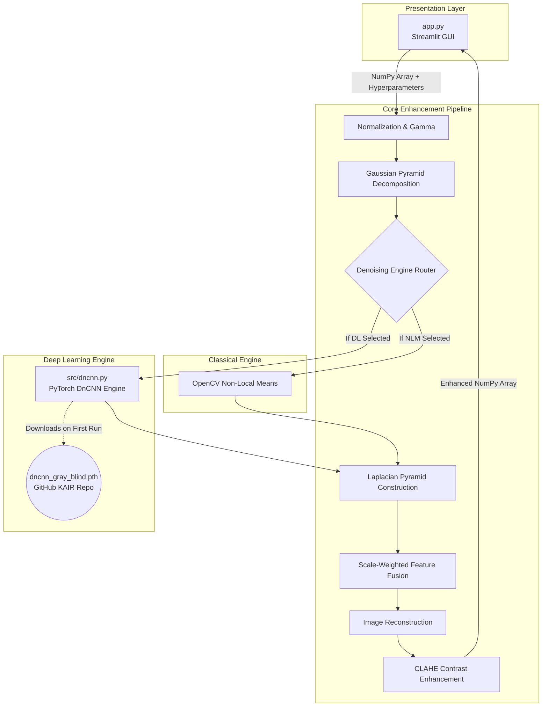

# LightForge: Comprehensive Codebase Overview & System Architecture

Welcome to the deeply expanded **LightForge** codebase documentation. This document serves as the ultimate technical reference for developers, data scientists, and clinical researchers aiming to understand, modify, or scale the LightForge image enhancement pipeline. 

LightForge is a sophisticated hybrid software system designed to address the complex challenges of artifact reduction and contrast enhancement in both low-light photography and medical imaging (specifically CT scans and X-Rays). It bridges the gap between traditional mathematical Computer Vision and modern Deep Learning inference.

---

## 1. 🏗️ System Architecture & Design Philosophy

LightForge is built on a modular, decoupled architecture, separating the presentation layer (UI) from the mathematical core and the Deep Learning inference engine.

### Core Technologies
- **Python 3.8+**: The foundational runtime environment.
- **OpenCV (cv2)**: Handles rapid matrix operations, color space conversions, and classical filtering (NLM, Gaussian Pyramids).
- **PyTorch (torch)**: The tensor-computation backend driving the Deep Learning denoising engine.
- **Streamlit**: Provides a highly reactive, web-based graphical interface for real-time parameter tuning.
- **Scikit-Image**: Used strictly for rigorous, academically validated quantitative metrics (PSNR/SSIM).

### High-Level Data Flow Diagram

---

## 2. 🖥️ The Presentation Layer (`app.py`)

The `app.py` script acts as the controller and the view in the MVC paradigm. Streamlit operates on a reactive execution model, meaning the entire script runs top-to-bottom every time a user interacts with a widget.

### 2.1 State Management & Caching
Because the PyTorch DnCNN model is heavy (containing hundreds of thousands of parameters), reloading it from disk on every slider tweak would render the UI unusable. LightForge uses `@st.cache_resource`:
- The `load_dl_model()` function is executed only once.
- The PyTorch `nn.Module` is stored in the Streamlit backend cache.
- The script automatically detects if a CUDA-enabled NVIDIA GPU is available (`torch.cuda.is_available()`) and mounts the model to VRAM, falling back to CPU seamlessly.

### 2.2 Input Normalization (`process_image`)
Medical imaging outputs from PACS systems or standard web uploads come in highly varied formats (1-channel grayscale, 3-channel RGB, 4-channel RGBA). 
- `app.py` intercepts the PIL image immediately.
- It forcibly normalizes all incoming data to a standard 3-channel RGB matrix (`image.convert("RGB")`). 
- This normalization ensures that both the color-space math in OpenCV and the tensor shapes in PyTorch never encounter dimensionality errors.

### 2.3 Interactive Hyperparameters
The sidebar exposes mathematical scalars directly to the user:
- **Pyramid Levels**: Defines how deep the image is decimated. More levels allow for denoising of larger structural artifacts.
- **Detail Strength**: A floating-point scalar dictating how aggressively high-frequency features (edges) are amplified during reconstruction.
- **Gamma / CLAHE Clip**: Parameters controlling the radiometric properties of the image.

---

## 3. 🧠 The Core Mathematical Pipeline (`src/multiscale_artifact_reduction.py`)

This file is the mathematical heart of LightForge. It implements a technique known as **Multi-Scale Feature Extraction**. Artifacts in CT scans and low-light images exist at multiple spatial frequencies. Attempting to denoise an image at a single scale inevitably destroys fine edges.

### 3.1 Gamma Correction
The initial step applies non-linear power-law gamma correction (`np.power(image, gamma)`). By applying this first, dark regions are stretched, making hidden noise visible and accessible to the subsequent denoising engines.

### 3.2 Gaussian Pyramid Decomposition
The algorithm calls `build_gaussian_pyramid()`. 
- The image is convolved with a Gaussian blur kernel to prevent aliasing, then downsampled by a factor of 2.
- This creates a stack of images, each representing a progressively lower-resolution version of the original.
- **Why?** Noise that spans 4 pixels in the original image shrinks to 1 pixel in the 3rd level of the pyramid, making it trivially easy to isolate and remove.

### 3.3 The Denoising Router
The pipeline iterates through every layer of the Gaussian pyramid and applies the chosen denoising engine.
- **Classical Route (`denoise_scale`)**: Uses `cv2.fastNlMeansDenoisingColored`. It replaces the color of a pixel with an average of the colors of similar pixels in the local neighborhood, preserving edges better than simple blurring.
- **Deep Learning Route (`dncnn_denoise`)**: Converts the NumPy layer into a PyTorch Tensor (`torch.from_numpy`), reshapes it to the required Batch-Channel-Height-Width format `(1, 1, H, W)`, and passes it through the neural network.

### 3.4 Laplacian Pyramid Construction & Feature Fusion
Once denoised, the algorithm calls `build_laplacian_pyramid()`.
- It takes a lower-resolution Gaussian layer, upsamples it, and subtracts it from the higher-resolution Gaussian layer above it.
- This subtraction leaves behind *only* the high-frequency details (textures, edges, bone structures in X-Rays).
- During fusion, these Laplacian layers are multiplied by a dynamic `weight` calculated from the user's `detail_strength` slider. Higher levels get a stronger boost, mathematically forcing structural details to pop.

### 3.5 Reconstruction
The boosted Laplacian details are recursively added back to the upsampled base layers until the original resolution is reached.

---

## 4. 🤖 The Deep Learning Engine (`src/dncnn.py`)

This module houses the custom PyTorch implementation of the **Denoising Convolutional Neural Network (DnCNN)**.

### 4.1 Residual Learning Theory
Unlike traditional networks that attempt to output a clean image directly, DnCNN is designed to output the **noise residual**. 
- The network predicts the noise map $V$.
- The clean image is mathematically defined as $X = Y - V$, where $Y$ is the noisy input.
- You can see this in the `forward` pass: `return y - out`.

### 4.2 Network Architecture
The architecture is strictly defined to match a specific set of pre-trained weights (`dncnn_gray_blind.pth`).
- **Depth**: 20 layers deep.
- **Channels**: 64 feature maps per layer.
- **Layers**: Composed exclusively of `nn.Conv2d` and `nn.ReLU`. 
- **No BatchNorm**: Unlike the color variant of DnCNN, this specific blind-denoising grayscale model relies entirely on biases (`bias=True`) rather than Batch Normalization.

### 4.3 Automated Provisioning
The `get_dncnn_model()` function contains automated Developer Operations (DevOps) logic. If the `dncnn_gray_blind.pth` file is missing from the directory, it uses Python's `urllib` to dynamically fetch the 2.6MB weights file from the author's official GitHub releases repository, ensuring zero manual setup for researchers.

---

## 5. 🛠️ Utilities and Metrics (`src/utils.py`)

This module isolates heavily reused processing functions to keep the core pipeline clean.

### 5.1 Contrast Enhancement (CLAHE)
`apply_clahe_lab` is arguably the most crucial visual post-processing step.
- Traditional Histogram Equalization washes out images and creates unnatural artifacts.
- CLAHE (Contrast Limited Adaptive Histogram Equalization) operates on small tiles (usually 8x8 pixels) rather than the whole image.
- **Color Preservation**: The algorithm converts the RGB image into the **LAB color space**. It applies equalization strictly to the `L` (Lightness) channel, leaving the `A` and `B` color channels completely untouched. This guarantees zero color shifting while massively boosting contrast.

### 5.2 Academic Metrics (`compute_metrics`)
To prove the efficacy of the pipeline, rigorous metrics are required:
- **PSNR (Peak Signal-to-Noise Ratio)**: Measures the absolute mathematical error between the ground truth and the enhanced image.
- **SSIM (Structural Similarity Index)**: A perception-based model that considers changes in structural information, luminance, and contrast, mimicking human visual perception.

---

## 6. ⚙️ Automation and Deployment (`RUN.bat`)

The deployment script ensures that LightForge can be launched reliably by non-technical clinical staff or researchers.

- **Environment Isolation**: It proactively checks for the `.venv` directory. If missing, it builds the virtual environment from scratch.
- **Dependency Management**: It silently updates `pip` and parses `requirements.txt` to ensure PyTorch, Streamlit, and OpenCV are perfectly synced.
- **Error Trapping**: It intercepts standard `ERRORLEVEL` exit codes, preventing the terminal from instantly vanishing if Python encounters a crash, allowing developers to read the traceback.
